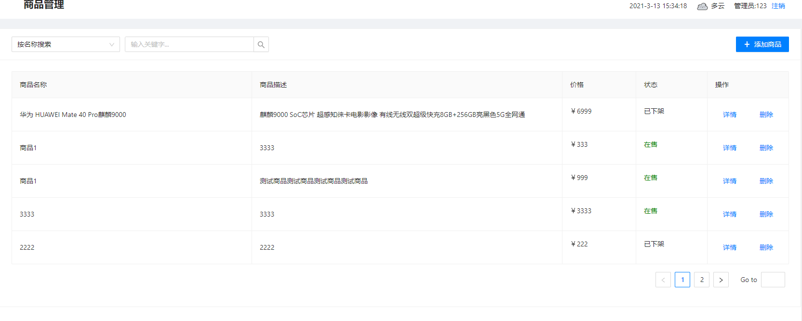
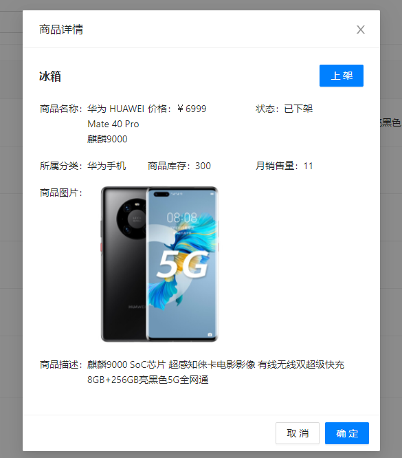
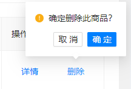
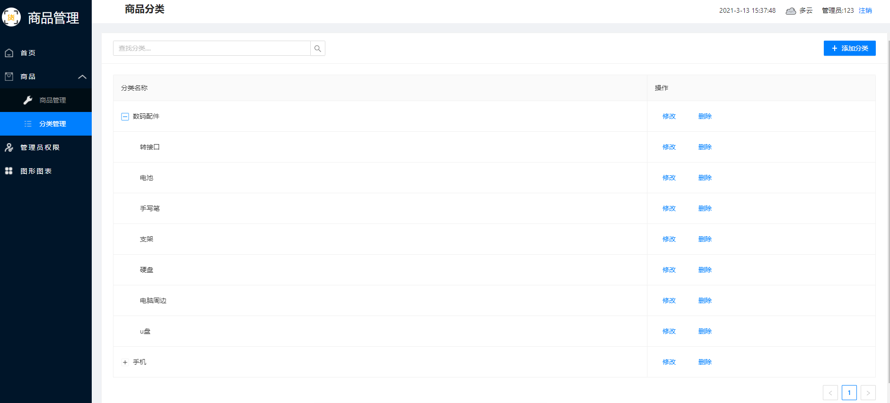
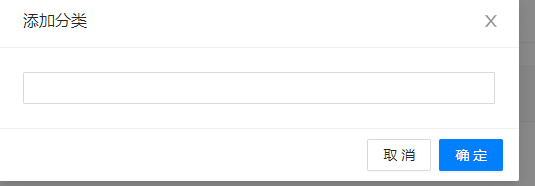

# 软件系统设计与体系结构课程设计

## 选题

选题是**商品管理系统**，使用 javascript 语言的 react 框架进行前端开发，服务端采用node.js进行开发，数据库 使用 MySQL。

#### 题目背景及意义

意义是**商品管理系统**是一个典型的信息系统，可以拓展的功能很多，为了更好地实现企业的经营目标，商品管理应坚持商品齐全和商品优选的原则。商品齐全就是要保证顾客来店时能够买到日常必需的商品，因此，商品品种要齐全。具体要求是：商品的品牌要全，商品的大类、品种和规格之间的结构比例要合适。商品优选就是要选择主力商品，在经营中，实际上大部分的销售额只来自于一小部分商品，即80%的销售额是由20%的商品创造的，这些商品是企业获利高的商品，要作为商品管理的重中之重。
## 关键技术简介

关键技术是 react，MySQL，html，css，js

简介可见实验二

增加一些阅读资料链接

[HTML教程](https://www.w3school.com.cn/html/index.asp)

[JavaScript教程](https://www.liaoxuefeng.com/wiki/1022910821149312)

[react框架](https://react.docschina.org/)

[SQL教程](https://www.liaoxuefeng.com/wiki/1177760294764384)

## 需求分析

### 功能需求

主要是对商品分类、商品信息以及上下架进行管理。

系统核心业务有：

* 管理员的登录

* 分类的增删查改以及分级

* 商品的增删查改已经商品的上下架

* 管理员权限等级的设置

* 图表展示相关数据

### 非功能需求

#### 安全性需求

权限等级较低的管理员无法对商品进行上下架也无法修改高级管理员的权限等级。

#### 性能/容量需求

响应时间不超过1.5秒

能存储海量的商品信息和分类信息

CPU占有率 < 50%

内容占有率 < 50%

#### 完整性需求

- 定义主码唯一性来实现实体完整性，定义违约处理若主键重复或空，或者其它非空的属性空则拒绝插入。

- 定义参照完整性，设置外键，参照表插入或修改时，定义违约处理拒绝操作，被参照表删除或修改时违约处理级联删除或修改。保证参照完整性。

- 定义用户定义的完整性，根据逻辑对数据表上的属性或元组加上约束条件。

- 定义断言对多个表或聚集操作比较复杂的完整性约束。

- 定义触发器在关系数据库管理系统核心层进行集中的完整性控制，实现更为复杂的检查和操作。

 

定义实体约束：

管理员的账号、密码、权限等级不可为空。

分类的名称、所属上级分类不可为空

商品名称、描述、状态等不可为空

### 应用流程分析

​		首先管理员通过账号密码登录系统，主界面左侧导航栏可以选择商品分类、商品管理、用户权限、图形图标。进入对应分区后可进行对应内容的增删查改和额外操作，不同的权限等级会受到不同的限制，顶部栏有管理员的基本信息以及天气时间等信息。

跨职能的业务流程图：


### 数据字典

#### 数据结构

 

| 数据元素名字：管理员                                           |
| ------------------------------------------------------------ |
| 别名：系统管理员                                               |
| 描述：管理员信息，提供管理员登录和各种事务                   |
| 定义：管理员=管理员ID+账号+密码+权限等级 |
| 数据存储：MySQL数据库                                        |
| 数据流：登录、获取账号信息时的数据载体                 |
| 外部实体：User                                         |
| 处理：登录时对比管理员填写的账号密码和管理员ID和密码是否一一对应 |
| 数据流来源：管理员内部配置                           |
| 数据流去向：登录、获取账号信息                               |
| 存取方式：顺序存储                                           |

 

 

| 名字：分类                                                   |
| ------------------------------------------------------------ |
| 别名：商品分类                                               |
| 描述：商品对应的一级和二级分类总和                           |
| 定义：分类=分类名称+分类ID+分类等级+所属上级 |
| 数据存储：MySQL数据库                |
| 数据流：新增分类、修改分类、删除分类               |
| 外部实体：Category                                     |
| 处理：增删查改时，待分类id和分类名称查询通过后，执行相关操作 |
| 数据流来源：管理员发起增删改请求                           |
| 数据流去向：前端界面展示分类信息             |
| 存取方式：按时间顺序存储                                     |

 

 

| 名字：商品                                                   |
| ------------------------------------------------------------ |
| 别名：商品信息                                           |
| 描述：商品的具体信息以及状态                             |
| 定义：商品=商品ID+商品名称+商品描述+商品所属分类+数量+状态+价格+商品图片      |
| 数据存储：MySQL数据库                |
| 数据流：管理员增删改对应商品信息时，会生成一条修改记录。 |
| 外部实体：Goods                                         |
| 处理：处理管理员提交的商品增删改，验证信息通过后执行对应操作。 |
| 数据流来源：管理员提交商品增删改请求时                               |
| 数据流去向：管理员查看商品列表以及商品详情时                       |
| 存取方式：按时间顺序存储                                     |


#### 数据流


## 总体设计

### 技术方案

1. 服务端：node.js
2. 前端：Html + CSS + JS + react + antd
3. 数据库：MySQL

### 类图

登录模块：


功能模块：


### UML

#### 活动图


#### 时序图


#### 状态图


## 详细设计

### 功能设计

#### 功能模块图

功能模块概要设计，给出功能模块图。


#### 输入输出设计、程序处理过程设计、安全性设计

 

| IPO图                                                        |                            |
| ------------------------------------------------------------ | -------------------------- |
| 模块名：登录                                                 | IPO图编号：1.1             |
| 上层模块：无                                                 | 下层模块：主页、商品、权限 |
| 编制者：甘宇航                                               |                            |
| 输入：账号密码                                               | 输出：登录结果             |
| 算法说明：  向服务端发送post请求，将输入的账号密码发送到后端，若验证成功就登录成功跳转到主界面，若密码错误或账号不存在则返回对应错误信息。 |                            |

 

| IPO图                                |                              |
| ------------------------------------ | ---------------------------- |
| 模块名：商品管理                     | IPO图编号：3.1               |
| 上层模块：登录                       | 下层模块：商品详细、上下架 |
| 编制者：甘宇航                       |                              |
| 输入：无                             | 输出：商品信息列表               |
| 算法说明：  向后端请求所有商品信息。 |                              |

 

| IPO图                                                        |                    |
| ------------------------------------------------------------ | ------------------ |
| 模块名：商品上下架                                             | IPO图编号：3.2     |
| 上层模块：商品管理                                           | 下层模块：无 |
| 编制者：甘宇航                                               |                    |
| 输入：上架/下架 标识符                                               | 输出：上下架结果 |
| 算法说明：  向后端发送POST请求修改当前商品的上下架状态，并返回对应的信息，若发生错误则弹窗警告。 |                    |

 

| 模块名：分类管理                 | IPO图编号：2.1     |
| -------------------------------- | ------------------ |
| 上层模块： 登录                  | 下层模块：分类修改 |
| 编制者：甘宇航                   |                    |
| 输入：无                         | 输出：分类信息列表     |
| 算法说明：  向后端请求所有分类信息 |                    |

 

| 模块名：分类修改                                             | IPO图编号：2.2     |
| ------------------------------------------------------------ | ------------------ |
| 上层模块： 分类管理                                          | 下层模块：无 |
| 编制者：甘宇航                                               |                    |
| 输入：新的分类信息                                               | 输出：对应操作结果 |
| 算法说明：  选择要修改的分类并输入新的分类信息，然后向后端发送POST请求，后端验证完成后对应修改到数据库并返回对应信息，若出错则弹窗警告。 |                    |

 

| 模块名：权限管理                                        | IPO图编号：4.1     |
| ------------------------------------------------------- | ------------------ |
| 上层模块： 登录                                         | 下层模块：权限设置 |
| 编制者：甘宇航                                          |                    |
| 输入：无                                            | 输出：当前系统所有管理员信息   |
| 算法说明：  向后端发送get请求获取所有管理员信息。 |                    |

 

| 模块名：权限设置                                         | IPO图编号：4.2     |
| -------------------------------------------------------- | ------------------ |
| 上层模块： 权限管理                                          | 下层模块：无 |
| 编制者：甘宇航                                           |                    |
| 输入：新的权限等级、对应管理员id                                             | 输出：修改结果 |
| 算法说明：  向后端发送POST请求修改对应管理员的权限等级。 |                    |


### UI设计

#### 登录页


#### 首页


#### 商品信息页


### 分类信息页


## 数据库设计

1.管理员信息实体

管理员信息实体用来存放管理员信息,包括:管理员id、管理员账号、密码、权限等级。

字段名|数据类型|是否为空|是否主键|描述|默认值
:-:|:-:|:-:|:-:|:-:|:-:
admin_id|varvarchar(4)|否|是|管理员id|NULL
account|varvarchar(10)|是|否|管理员账号|NULL
password|varvarchar(16)|是|否|密码|NULL
authority|int|是|否|权限等级|NULL

2.商品信息实体

商品信息信息实体用来存放商品信息信息,包括: 商品id、商品名称、商品分类、商品状态、商品描述、价格、库存。

字段名|数据类型|是否为空|是否主键|描述|默认值
:-:|:-:|:-:|:-:|:-:|:-:
id|int|否|是|商品id|NULL
goods_name|varchar(16)|是|否|商品名称|NULL
describe|varchar(255)|是|	否|商品描述|NULL
category|varchar(16)|是|否|商品分类|NULL
status|varchar(20)|是|否|商品状态|NULL
count|int|是|否|商品库存|NULL
price|int|是|否|商品价格|NULL

3.分类信息实体

分类信息实体用来存放分类信息,包括:分类id、分类名称、分类等级、所属上级分类。

字段名|数据类型|是否为空|是否主键|描述|默认值
:-:|:-:|:-:|:-:|:-:|:-:
id|varchar(16)|否|是|分类id|NULL
name|varchar(16)|是	|否|分类名称|NULL
grade|int|是|否|分类等级|	NULL
belong|varvarchar|是|否|所属上级分类|NULL

---

### 模块设计

#### Web框架

使用react框架create-react-app，Create React App是FaceBook的React团队官方出的一个构建React单页面应用的脚手架工具。它本身集成了Webpack，并配置了一系列内置的loader和默认的npm的脚本，可以很轻松的实现零配置就可以快速开发React的应用。

#### 连接数据库

```javascript
// 数据库连接的配置
const Sequelize = require('sequelize')


const sequelize = new Sequelize('goods_system', 'root', '130358', {
    host: "127.0.0.1",
    dialect: 'mysql', // 数据库类型
    define: {
        timestamps: false
    },
    pool: { // 连接池配置
        max: 5, // 最大连接数
        min: 0,  // 最小连接数
        acquire: 30000, // 请求超时时间
        idle: 10000, // 断开连接后，连接实例在连接池保持的时间
    },
    logging: true
})

// 测试连接是否成功
sequelize
    .authenticate()
    .then(() => {
        console.log('数据库连接成功.')
    })
    .catch(err => {
        console.log('连接失败：', err)
    })


module.exports = { sequelize, Sequelize }
```

#### axios发送请求

axios 是一个基于Promise 用于浏览器和 nodejs 的 HTTP 客户端，本质上也是对原生XHR的封装，只不过它是Promise的实现版本，符合最新的ES规范，有以下特点：

+ 从浏览器中创建 XMLHttpRequests
+ 从 node.js 创建 http 请求
+ 支持 Promise API
+ 拦截请求和响应
+ 转换请求数据和响应数据
+ 取消请求
+ 自动转换 JSON 数据
+ 客户端支持防御 XSRF

### 关键模块代码实现

#### 登录

首先连接数据库，启动服务器

前端api定义
```javascript
import axios from 'axios';

const htttp = axios.create({
    timeout: 50000
})

function req(url, method, data) {
    if (method === 'get') {
        return htttp.get(url).then(res => Promise.resolve(res)).catch(err => Promise.reject(err));
    } else {
        return htttp.post(url, data).then(res => Promise.resolve(res)).catch(err => Promise.reject(err));
    }
}

export const login = (data) => {
    return req('/user/login', 'post', data);
}
```

后端登录方法
```javaScript
// 用户表模型
const dataBase = require('../config/db')

let sequelize = dataBase.sequelize,
    Sequelize = dataBase.Sequelize

const UserModel = sequelize.define('admin', {
    admin_id: {
        type: Sequelize.INTEGER,
        primaryKey: true
    },
    admin: Sequelize.STRING,
    password: Sequelize.STRING,
    authority: Sequelize.INTEGER
})

class User {
    // 用户登录方法：查询用户名以及验证密码是否正确
    static async userLogin(username, password) {
        let obj = {}
        const res = await UserModel.findOne({ where: { admin: username } })
        obj.data = res
        if (res && res.password === password) {
            obj.message = '登陆成功'
            obj.code = 1
        } else if (res) {
            obj.message = '密码不正确'
            obj.code = 0
        } else {
            obj.message = '用户名不存在'
            obj.code = 0
        }
        return obj
    }
}
```

获取管理员账号和密码并发送到后端验证

```html
        <div className="login">
            {/*  */}
            <video src="assets/table.mp4" className="common bg" loop autoPlay="autoplay" muted></video>

            <Draggable>
                <section className='form-field' id="form-field">

                    <div className='title'>
                        <p className='main-title'>商品管理系统</p>
                        <p className='sub-title'>提供更便捷、更快速的商品管理UI</p>
                        <div className='filter'></div>
                    </div>

                    <Form
                        ref={formRef}
                        {...layout}
                        name="basic"
                        initialValues={{
                            remember: true,
                        }}
                        onFinish={onFinish}
                    // onFinishFailed={onFinishFailed}
                    >
                        <Form.Item
                            label="账号"
                            name="username"
                            rules={[
                                {
                                    whitespace: true,
                                    required: true,
                                    message: '用户名不能为空',
                                },
                            ]}
                        >
                            <Input />
                        </Form.Item>

                        <Form.Item
                            label="密码"
                            name="password"
                            rules={[
                                {
                                    whitespace: true,
                                    required: true,
                                    message: '密码不能为空',
                                },
                            ]}
                        >
                            <Input.Password />
                        </Form.Item>

                        <Form.Item {...tailLayout}>
                            <Button type="primary" htmlType="submit">
                                登录
    </Button>
                        </Form.Item>
                    </Form>
                </section>
            </Draggable>
        </div>
```

```javascript
    // 登录
    const onFinish = async () => {
        console.log('用户名和密码:', formRef.current.getFieldsValue(true));
        let { username, password } = formRef.current.getFieldsValue(true);
        let data = { username, password };
        const loginRes = await login(data);
        console.log("登录：", loginRes);
        if (loginRes.data.code) {
            sessionStorage.setItem('user', JSON.stringify(loginRes.data.data));
            history.replace('/admin');
        } else if (loginRes.data.message === '密码不正确') {
            message.error('密码不正确');
        } else {
            message.error('用户名不存在');
        }
    }
```

如果后端查询数据库验证成功后则返回对应响应给前端，前端跳转到主页。


# 系统测试
## 登录界面测试

在浏览器中输入: http://localhost:8080/ssm_02_weapp_war_exploded/login.jsp ,系统显示正常,登陆页面如图


## 用户登录测试

当未输入账号和密码时，并点击登录按钮，系统提示亲输入账号和密码；当输入错误的账号和密码时，并点击登录按钮，系统提示账号和密码错误；当输入正确的账号和密码时，点击登录按钮，系统提示登录成功。输入错误的账号和密码，系统提示如图


## 商品管理功能测试

点击左侧导航栏的商品管理，进入如下页面:



点击详情可查看对应商品的具体信息:



点击删除时弹出气泡确认框:



## 分类管理功能测试

点击左侧导航栏的分类管理，进入分类信息界面，如下:



点击添加分类弹出模态框输入新的分类名称：



## 权限管理功能测试

点击左侧导航栏的权限管理，进入管理员信息界面，如下:


## 总结与体会

由于是第一次尝试进行react框架的开发，但之前有过SPA单页应用开发的经验，虽说对框架的知识还比较模糊，但对开发的流程还算熟悉。最大的困难在于框架的配置以及写法上，需要花较多时间去熟悉框架的api以及数据绑定、状态管理等内容，还有就是react的路由跳转相关的知识。项目中大量使用了antd的组件，在学习组件的用法以及查看文档上也用了不少时间。而对于后端的实习则是采用了node.js的框架koa进行编写，其中也复用了部分我之前项目的代码，例如后端的路由判断模块，总体来说基本上都是增删查改的内容，实现难度不算大，但在sequlize的配置上遇到了不小的麻烦，最后还是找了大量博客去学习最终解决。

项目实现了管理系统的基本功能，但距离真正的商品管理平台应用还是有很大差别，安全性比较差，功能比较单一。但通过这次课设我收获颇多，把学到的react知识点基本上都运用到了实践上，也提高了我的代码编写能力，时间管理能力，同时也是第二次尝试前端后台都由自己在本地完成并进行对接，对比于早些时候的只进行前端代码的编写来说，两端的同时开发也让我更加了解了web应用开发的流程以及重点难点，对以后的工作提供了不错的经验。

